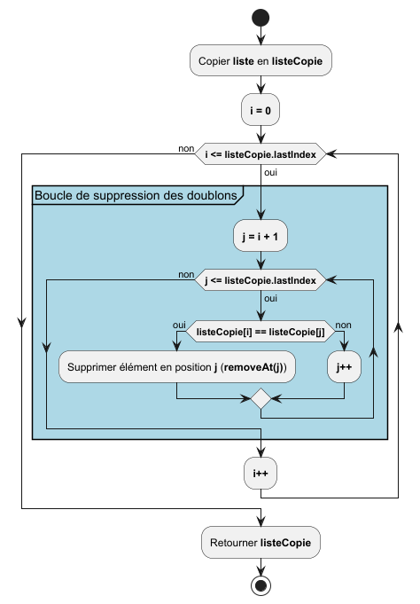
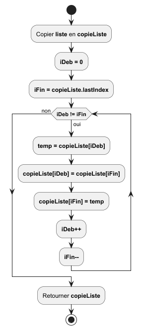

 # SUJET 03 : Manipulation de listes

## Présentation générale :
Cette partie propose des problèmes qui appliquent des manipulations comme des permutations de valeurs dans des listes.

## Sujet 03-a : Supprimer les doublons

### Présentation de l'algorithme :
La fonction prend tout simplement une liste contenant potentiellement des valeurs en doublon. Elle retourne une copie de liste initiale sans les doublons, mais en conservant l'ordre initiale des valeurs.

### Travail à réaliser :

Compléter la fonction `supprimerDoublons(liste: List<Int>): MutableList<Int>` en implémentant un algorithme qui supprime les doublons.
#### Remarques :
- Vous utiliserez la méthode `.removeAt(i)` pour supprimer une valeur située à l'indice **`i`**.
- Vous utiliserez des boucles `while (...)` car les boucles `for (in ...)` provoquerons une erreur si vous supprimez une valeur pour la raison que l'indice de la dernière valeur ne sera plus valide.

Nous vous proposons l'algorithme suivant pour résoudre ce problème :

### EXEMPLE 1 :
* Liste donnée : [5, 5, 1, 3, 1, 7, 9, 3]
* Résultat : [5, 1, 3, 7, 9]

### EXEMPLE 2 :
* Liste donnée : [1, 2, 3, 4, 5]
* Résultat : [1, 2, 3, 4, 5]

### EXEMPLE 3 :
* Liste donnée : [7, 7, 7, 7]
* Résultat : [7]

### EXEMPLE 4 :
* Liste donnée : [5]
* Résultat : [5]

## Sujet 03-b : Inversion d'une liste

### Présentation de l'algorithme :
Le problème ici consiste tout simplement à réaliser un algorithme qui retourne une copie d'une liste en inversant l'ordre de ses valeurs.

### Travail à réaliser :

Compléter la fonction `inverserListe(liste: List<Int>): MutableList<Int>`. Elle prend en argument une liste à trier et retourne une copie de la liste avec les valeurs inversées. L'algorithme doit procéder à une série de permutations pour réaliser sa tâche.

#### Aide :
L'une de solution consiste à réaliser une série de permutations entre la 1ère valeur et la dernière; puis la 2e valeur
et l'avant dernière et ainsi de suite...
Cette solution peut être représentée par l'algorithme suivant :

### EXEMPLE 1 :
* Liste donnée : [1, 2, 3, 4, 5]
* Résultat : [5, 4, 3, 2, 1]

### EXEMPLE 2 :
* Liste donnée : [1]
* Résultat : [1]

## Sujet 03-c : Zéro à gauche & un à droite

### Présentation de l'algorithme :
L'algorithme traite des listes comportant uniquement des **0** et **1** comme valeurs. Il retourne une copie de la liste avec tous les **0** placés à gauche et tous les **1** sont placés à droite. 

### Travail à réaliser :

Compléter la fonction `zeroGaucheUnDroit(liste: List<Int>): MutableList<Int>`. La liste en argument contient uniquement des **0** et des **1**. La liste retournée a tous les **0** à gauche et tous les **1** à droite.

#### Aide
L'algorithme suivant permet de résoudre le problème.

### EXEMPLE 1 :
* Liste donnée : [1, 0, 1, 0, 1, 0, 1]
* Résultat : [0, 0, 0, 1, 1, 1, 1]

### EXEMPLE 2 :
* Liste donnée : [1, 1, 0, 0, 0]
* Résultat : [0, 0, 0, 1, 1]